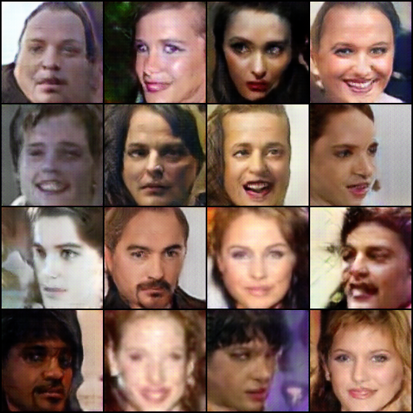

<h1 align="center">Face Generation with DCGAN and WGAN-GP loss </h1>
<div align="center">

</div>
<br><br>


In this project I have implemented a Generative Adversarial Network for face generation, using WGAN-GP loss.
The network was trained to generate 128x128 pixels images of human faces, inspired by the website [www.thispersondoesnotexist.com](https://www.thispersondoesnotexist.com).</br>

# The architecture
The architecture of Generator and Discriminator are inspired by the DCGAN paper "Unsupervised Representation Learning With Deep Convolutional Generative Adversarial Networks". Regarding the loss, I tried the original Binary Cross Entropy loss formula take from the "Generative Adversarial Networks" paper, but the models were subejct to Mode Collapse, so I decided to implement a Wasserstein Loss with Gradient Penalty (WGAN-GP).

# Training
I trained the model for about 30 epochs on the Casia-webface dataset, containing about 500k images of human faces. The accuracy I obtained is not perfect, but it's enough to make me happy! With more training, the model can surely be improved. 

# How to use

If you wish to use this repo for training your own version of the model or just to generate faces with the existing model versions included in the repo (in the "releases" section), you can easily do it.</br>
You can also train models with different sizes (small, medium or big).</br>
To train a new model, you first need to download the casia-webface dataset, which I downloaded from [here](https://www.kaggle.com/datasets/debarghamitraroy/casia-webface), and unzip the folder.</br>
Reading the binary file that contains the dataset makes use of the mxnet Python library, which from my experience works only on Linux machines, and with numpy 1.23.5.</br>
To train a model:
```
python main.py -mode train -model_size big -num_epochs 50 -gen_path ./checkpoint_gen.pth.tar -disc_path ./checkpoint_disc.pth.tar
```
To generate images with a trained generator model:
```
python main.py -mode generate -model_size big -gen_path ./checkpoint_gen.pth.tar
```
To generate a video of an interpolation between two images:
```
python main.py -mode interpolate -model_size big -gen_path ./checkpoint_gen.pth.tar
```
An example of interpolation video is the following:</br>
<div align="center">


</img> 
</div>
<br>

For the full list of available options, just run 
```
python main.py --help
```
